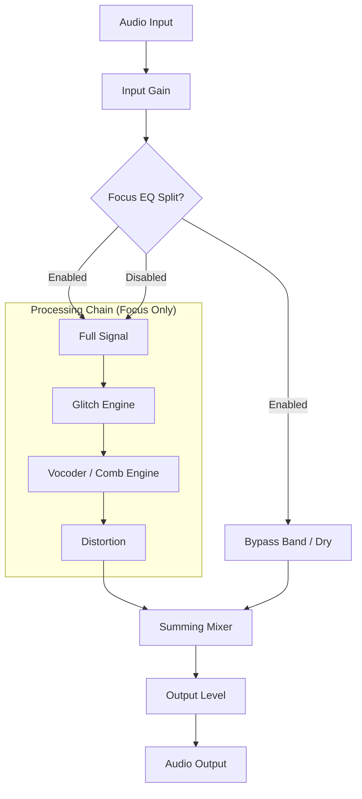

# 🎛️ Chromatic Glitch — Creative Audio Plugin

  <strong>A creative audio effect plugin for glitch, vocoder, and distortion processing.</strong> 
  一款专为故障音效、声码器和失真处理设计的创意音频效果插件。 

  
  
  

**Chromatic Glitch** is a professional audio plugin engineered by **Vox — Zonic Design Production**. It combines three powerful engines into a single, cohesive sound design toolkit: a buffer-based glitch engine, a 32-band channel vocoder, and a multi-algorithm distortion stage.

If you are looking for an instrument of controlled chaos to shatter and rearrange audio in real-time, this is it.

[Website & Demo Download](https://chromatic-glitch-web.vercel.app) · [Report an Issue](mailto:legal@zonicdesign.com)

---

## Highlights

- **Glitch Engine** — Buffer-based stutter, reverse, and half-speed tape effects perfectly synced to your DAW's tempo.
- **Vocoder/Comb Engine** — Morph seamlessly between a pristine 32-band pure channel vocoder and a dense, resonant comb filter bank.
- **Distortion Algorithms** — 8 unique drive circuits expanding from warm Tube styling to brutal Bitcrushing.
- **Focus EQ Architecture** — Isolate the exact frequency band you want to destroy, leaving the rest of your mix untouched.
- **Hardware-locked Security** — RSA-2048 cryptographic mechanisms bind your license to your unique studio setup.

---

## Signal Routing

The plugin uses a unique "Focus EQ" architecture, allowing you to target effects to a specific frequency band while keeping the rest of the signal dry.

## Control Guide

### Input Section

- **INPUT**: Controls the incoming signal level before processing.
- **FOCUS EQ (Button)**: Activates the frequency-split mode.
- **FREQ**: Sets the center frequency of the focus band.
- **WIDTH (Q)**: Sets the width/resonance of the focus band.

### Glitch Engine

- **MODE**: `Stutter` (repetitive chopping), `Reverse` (reverse buffer play), `Half-Speed` (tape-like slowdown).
- **RATE**: Speed of the glitching effect.
- **MIX**: Dry/Wet control for the glitch engine.
- **BPM SYNC**: Syncs the Rate to your DAW's tempo.

### Color / Vocoder Engine

- **ENGINE MODE**: Switch between **Comb Bank** and **32-Band Vocoder**.
- **COLOR / MORPH**: Controls filter resonance (Comb mode) or spectral clarity and brightness (Vocoder mode).
- **ATTACK / RELEASE**: Envelope follower speed for the vocoder.
- **SHIFT**: Shifts frequency bands for formant-shifting effects.
- **CARRIER / MOD / NOISE**: Independent mix controls for internal vocoder components.

### Output Section

- **DRIVE ALGORITHM**: 8 modes including Soft Sat, Bitcrush, and Germanium Fuzz.
- **DRIVE**: Controls the intensity of the distortion.
- **OUTPUT**: Final volume control.

---

## Quick Start (Activation)

1. Open your DAW and instantiate **Chromatic Glitch** on a track.
2. The UI will display a **Machine ID** unique to your hardware configuration.
3. Click the **REGISTER** button in the top right corner.
4. Provide the Machine ID to the developer to receive your unique `Activation Code`.
5. Paste the code back into the plugin to unlock the full version.

> **Note on Privacy:** Your Machine ID is a mathematically generated hash based on your system's hardware configuration. It contains no personal data and is completely safe to share.

### Demo Mode Restrictions

Until activated, the plugin operates in Demo Mode:

- **Glitch Mode**: Locked to "Stutter".
- **Distortion Mode**: Restricted to Soft Sat, Wavefold, and Germanium.
- **Vocoder**: Parameter adjustments are limited.
- **UI Overlay**: A watermark is displayed on the interface.

---

## License & Security Statement

Chromatic Glitch is proprietary software developed by **Vox — Zonic Design Production**.

> **⚠️ WARNING: Software piracy is a serious crime.**
>
> Chromatic Glitch uses **RSA-2048 cryptographic hardware-locked licensing**. Each copy is uniquely tied to the user's machine.
> Any attempt to crack, patch, bypass, or circumvent the activation system constitutes a violation of the **DMCA**, **CFAA**, and other applicable intellectual property laws.
>
> **Zonic Design Production will actively pursue all legal remedies available**, including seeking statutory damages up to **$150,000 per infringement** (17 U.S.C. § 504). Distributing cracked copies exposes the distributor to contributory and vicarious copyright infringement liability.

If you discover unauthorized copies or security vulnerabilities, please responsibly disclose to: **<security@zonicdesign.com>**

## Credits

- **Developer**: Vox — Zonic Design Production
- **Framework**: [JUCE](https://juce.com)
- **Audio DSP**: Custom C++ implementations

*© 2026 Vox — Zonic Design Production. All rights reserved. Unauthorized reproduction or distribution is prohibited by law.*
