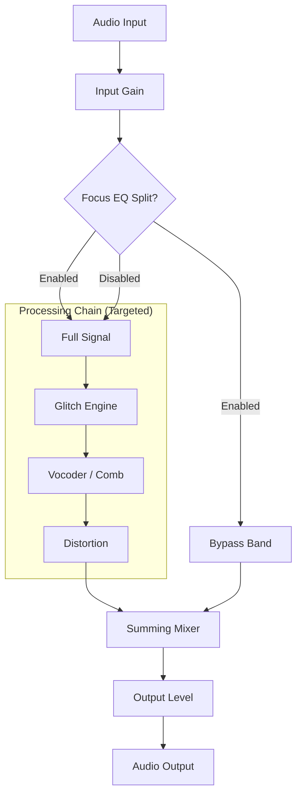

# 🎛️ Chromatic Glitch — Creative Audio Effect Plugin

[English](README.md) | [简体中文](README_zh.md) | [Quick Start (Activation)](#quick-start-activation)

  <strong>A creative audio effect plugin for glitch, vocoder, and distortion processing.</strong> 
  一款专为故障音效、声码器和失真处理设计的创意音频效果插件。 

  
  
  

**Chromatic Glitch** is a professional audio plugin developed by **Vox — Zonic Design Production**. It combines three powerful engines into a single cohesive sound design toolkit: a buffer-based Glitch engine, a 32-band channel vocoder, and a multi-algorithm distortion unit.

[Visit Website & Download Demo](https://chromatic-glitch-web.vercel.app) · [Report Issues](mailto:legal@zonicdesign.com)

---

## Core Features

- **Glitch Engine** — Buffer-based Stutter, Reverse, and Half-Speed effects, perfectly synced with your DAW tempo.
- **Vocoder/Comb Engine** — Seamlessly morph between a pristine 32-band classic channel vocoder and a dense, resonant comb filter bank. **Now supporting external sidechain carrier input**.
- **Distortion Algorithms** — 8 unique drive circuits ranging from warm analog saturation to brutal digital bitcrushing. (Beta v0.0.1.2: Stabilized DSP routing).
- **Focus EQ Architecture** — Isolate exact frequency bands for targeted destruction without losing mix clarity.
- **Hardware-Locked Security** — Advanced RSA-2048 cryptographic locking ties your license securely to your unique studio environment.

---

## Signal Routing

The unique "Focus EQ" architecture allows you to apply extreme effects to a specific frequency band while leaving the rest of the signal untouched.

## Channel Vocoder DSP (v0.0.1.2)

Chromatic Glitch features a true 32-band channel vocoder designed for high-resolution vocal synthesis.

- **External Sidechain (New)**: Support for external carrier signals. Route a synth (like Serum) to the sidechain input to let your vocals "play" the synth spectrum for authentic **Colorbass** sounds. (v0.0.1.2)
- **Spectrum Mapping**: An array of 32 cascaded 2nd-order bandpass filters extracts the spectral envelope of the modulator and maps it onto the carrier signal.
- **Formant Shifting**: The **SHIFT** control allows for real-time frequency-band translation, creating iconic formant-shifting vocal effects.
- **Optimization**: Recent updates include pointer-stable parameter caching for enhanced UI rendering performance. Fixed V-Wide UI overlap in v0.0.1.2.

---

## Control Guide

### Input Section

- **INPUT**: Controls level before processing.
- **FOCUS EQ (Button)**: Activates frequency splitting.
- **FREQ**: Sets center frequency for the Focus band.
- **WIDTH (Q)**: Controls bandwidth or resonance of the split.

### Glitch Engine

- **MODE**: Stutter, Reverse, or Half-Speed.
- **RATE**: Speed of the glitch effects.
- **MIX**: Dry/Wet control for the Glitch path.

### Color / Vocoder

- **ENGINE MODE**: Toggle between Comb Bank and 32-Band Vocoder.
- **COLOR / MORPH**: Sets resonance (Comb) or clarity/brightness (Vocoder).
- **SHIFT**: Formant shifting control.
- **V-WIDE (Bandwidth)**: (v0.0.1.2) Long horizontal slider at the bottom for precise frequency width control. Fixed UI layout regression.

---

## Quick Start (Activation)

1. Load **Chromatic Glitch** onto a track in your DAW.
2. The UI will display a unique **Machine ID** based on your hardware.
3. Click **REGISTER** in the top-right corner.
4. Send this Machine ID to the developer or use it on the activation portal to get your `Activation Code`.
5. Paste the activation code into the plugin to unlock and enjoy!

---

## Anti-Piracy & Legal

Chromatic Glitch is proprietary software. Unauthorized reproduction or distribution is strictly prohibited.

> **⚠️ WARNING: Software piracy is a serious crime.**
>
> This software uses **RSA-2048 hardware-locked licensing**. Zonic Design Production will actively pursue all legal remedies, including statutory damages up to **$150,000 per infringement** (17 U.S.C. § 504).

For security disclosures or piracy reports: **<security@zonicdesign.com>**

---

*© 2026 Vox — Zonic Design Production. All rights reserved. Built with JUCE.*
