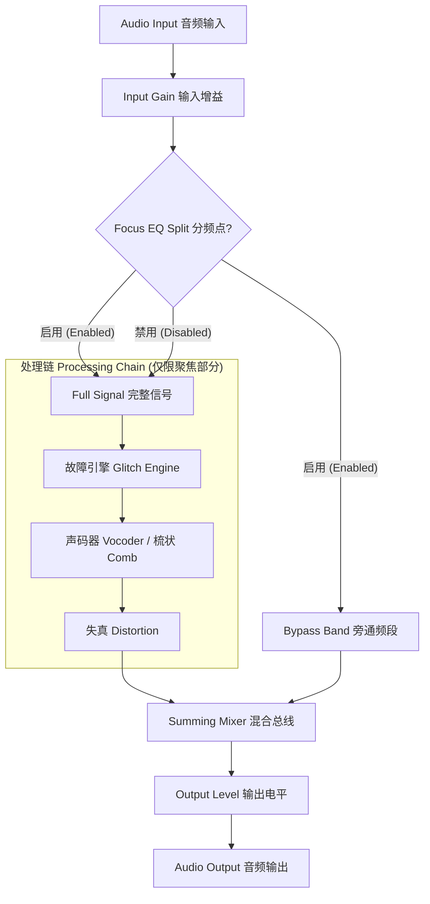

# 🎛️ Chromatic Glitch — 创意音频效果插件

[English](README.md) | [简体中文](README_zh.md) | [快速上手指南 (激活说明)](#快速上手指南-激活说明)

  <strong>一款专为故障音效、声码器和失真处理设计的创意音频效果插件。</strong> 
  A creative audio effect plugin for glitch, vocoder, and distortion processing. 

  
  
  

**Chromatic Glitch** 是由 **Vox — Zonic Design Production** 独家研发的专业音频插件。它将三大强力引擎整合为一个极具凝聚力的声音设计工具包：基于缓冲区的故障（Glitch）引擎、16 频段通道声码器，以及多算法失真处理单元。

如果您需要一个能实时粉碎并重构音频、用来掌控音乐中混乱元素的强力乐器，这就是您的最佳选择。

[访问官网 & 下载试用版](https://chromatic-glitch-web.vercel.app) · [报告问题](mailto:legal@zonicdesign.com)

---

## 核心特性

- **故障引擎 (Glitch Engine)** — 基于缓冲的断续 (Stutter)、反转 (Reverse) 和半速磁带 (Half-Speed) 效果，与您的 DAW 速度完美同步。
- **声码器/梳状引擎 (Vocoder/Comb)** — 在原始的 16 频段纯粹通道声码器和密集、共振的梳状滤波器组之间无缝渐变。**现已支持外部侧链载波输入**。
- **失真算法 (Distortion)** — 提供 8 种独特的驱动电路，从温暖的电子管染色到残酷的位深破碎。在 v0.0.1.2 中已优化并稳定信号链。
- **聚焦均衡架构 (Focus EQ)** — 精准隔离您想要破坏的独立频段，同时不影响混音中其他元素的清晰度。
- **硬件安全绑定** — 采用硬件级别的密码学质询-应答激活机制，将您的许可证与您的专属工作室运算环境紧密绑定。

---

## 信号路由

本插件采用了独特的 "Focus EQ"（聚焦均衡）架构，允许您将极端效果专门施加于某一个特定频段，同时保留其它原有的纯净信号（干声）。

## 通道声码器架构 (Channel Vocoder DSP)

Chromatic Glitch 内置了一个真正的 16 频段通道声码器，其设计灵感来自于经典的硬件声码器结构 (核心数字信号处理概念借鉴了 [yu2924/ChannelVocoder](https://github.com/yu2924/ChannelVocoder) 的开源研究)。

- **核心机制**：它使用高精度的滤波器组，将 **载波 (Carrier, 即乐器输入)** 与 **调制器 (Modulator, 即人声输入)** 各自分隔为密集的 16 个独立频段。
- **外部侧链支持 (v0.0.1.2)**：支持外部载波输入。您可以将合成器(如 Serum)路由至侧链，使人声实时“控制”合成器的音高与频谱，打造纯正的 Colorbass 音色。
- **动态包络跟随**：在每一个离散的频段内，包络跟随器 (Envelope Follower) 会实时追踪人声调制器的音量起伏变化，并使用该曲线动态控制对应乐器载波频段的 VCA 增益。
- **频谱轮廓映射**：最终，所有 16 个载波频段的音频输出会被重新 Summing (混合)。这样做的完美结果，就是将人声声道的发音频谱轮廓（口型形状）不可思议地叠加到了合成乐器的谐波结构之上。
- **性能优化**：滤波器组由级联的二阶带通滤波器构成，在 v0.0.1.2 中通过指针缓存进一步优化了 UI 渲染稳定性，并修复了 V-Wide UI 堆叠。

## 控制指南 (Control Guide)

### 输入部分 (Input Section)

- **INPUT**: 控制进入处理链之前的输入信号电平。
- **FOCUS EQ (按钮)**: 激活频率分频模式。
- **FREQ**: 设置聚焦频段的中心频率。
- **WIDTH (Q)**: 设置聚焦频段的带宽或共振程度。

### 故障引擎 (Glitch Engine)

- **MODE (模式)**: 包含 `Stutter` (重复断续切碎)，`Reverse` (反向播放缓冲区)，`Half-Speed` (类似磁带减速的效果)。
- **RATE**: 故障效果的播放速度。
- **MIX**: 控制故障引擎的干湿混合比例。
- **BPM SYNC**: 将效果速度与您的宿主 DAW 速度同步。

### 颜色 / 声码器引擎 (Color / Vocoder)

- **ENGINE MODE (引擎模式)**: 在 **Comb Bank (梳状滤波器组)** 和 **32-Band Vocoder (32 频段声码器)** 之间切换。
- **COLOR / MORPH**: 控制滤波器的共振（梳状模式中）或声码器频段的清晰度与亮度（声码器模式中）。
- **ATTACK / RELEASE**: 为声码器包络跟随器设置反应速度。
- **SHIFT**: 偏移频段，从而得到类似共振峰偏移的人声发音改变效果。
- **CARRIER / MOD / NOISE**: 为声码器内部构件提供的独立混合比例控制。
- **V-WIDE (带宽)**: (v0.0.1.2 新增) 位于底部的长水平滑块，用于精确调节频段宽度。已修复 UI 回归问题。

### 输出部分 (Output Section)

- **DRIVE ALGORITHM**: 8 种失真模式，包含软饱和 (Soft Sat)、位宽破碎 (Bitcrush) 以及锗二极管法兹 (Germanium Fuzz) 等。
- **DRIVE**: 控制失真的饱和或破坏强度。
- **OUTPUT**: 最终输出的总音量控制。

---

## 快速上手指南 (激活说明)

1. 打开您的 DAW，并将 **Chromatic Glitch** 加载到任一轨道上。
2. 插件的用户界面将显示一个独一无二的 **Machine ID (机器码)**，该 ID 基于您的硬件信息生成。
3. 点击界面右上角的 **REGISTER (注册)** 按钮。
4. 将该 Machine ID 发送给开发者，或者在激活平台使用它获取您的专属 `Activation Code (激活码)`。
5. 将得到的激活码粘贴回插件窗口中，即可成功解锁完整版本。

> **隐私保护声明：** 您的 Machine ID 是纯基于硬件配置生成的数学哈希值。它不包含您的任何个人数据或隐私信息。您可以绝对安全地分享此 ID 进行激活。

### 试用版限制说明 (Demo Restrictions)

在尚未激活前，插件将在功能受限的试用模式 (Demo Mode) 下运行：

- **故障模式**: 被永久锁定为 "Stutter"。
- **失真模式**: 被限制为仅能使用 Soft Sat, Wavefold, 和 Germanium 三种。
- **声码器**: 部分核心参数无法调节。
- **用户界面**: 界面上会覆盖一层试用版专属的半透明水印。

---

## 许可及安全声明

Chromatic Glitch 是由 **Vox — Zonic Design Production** 研发与持有的专有商业软件。

> **⚠️ 警告：软件盗版是严重的违法行为。**
>
> Chromatic Glitch 使用了高强度的**硬件级别质询-应答锁定防御授权**系统。您的每一份正版拷贝都已与您的创作硬件实现了深度关联与唯一锁定。
> 任何意图破解、打补丁修改、绕过或试图规避此激活系统的行为，均直接违反各有关知识产权保护法（包括不限于 **DMCA** 与 **CFAA**）。
>
> **Zonic Design Production 坚决维护自身合法权益，并将积极寻求一切可用的法律救济措施**，其中包括对每次侵权行为最高索要 **150,000 美元** 的法定损害赔偿 (依据 17 U.S.C. § 504)。任何分发破解版本的个人或团体，不仅自身触法，还将在法律上承受严重的“共同侵权与替代侵权责任”。

如果您在互联网发现任何未经授权的拷贝分发，或是发现授权系统内的安全漏洞，恳请您向我们在法律与安全层面的邮箱负责人进行负责任的披露与举报：**<security@zonicdesign.com>**

## 致谢 / Credits

- **开发者 (Developer)**: Vox — Zonic Design Production
- **UI 框架 (Framework)**: [JUCE](https://juce.com)
- **核心音频算法 (Audio DSP)**: 定制化的 C++ 矩阵算法实现

*© 2026 Vox — Zonic Design Production. 保留所有权利。严禁一切未经授权的翻录、逆向或重新分发。*
