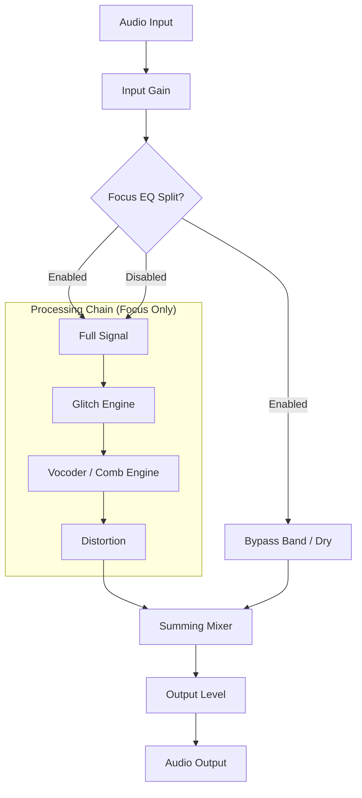

# Chromatic Glitch: User Manual / 用户手册

# Beta v0.0.1

Developed by **Vox — Zonic Design Production**

---

## 1. Introduction / 简介

**Chromatic Glitch** is a professional audio plugin designed for creative sound design, combining buffer-based glitching, a 32-band channel vocoder, and a multi-algorithm distortion engine.
**Chromatic Glitch** 是一款专为创意声学设计开发的专业音频插件，结合了基于缓冲区的故障处理、32 频段通道声码器以及多算法失真引擎。

---

## 2. Signal Routing / 信号路由

The plugin uses a unique "Focus EQ" architecture, allowing you to target effects to a specific frequency band while keeping the rest of the signal dry.
插件采用独特的 "Focus EQ"（聚焦均衡）架构，允许您将效果针对特定的频段，同时保持其他信号为干声。

---

## 3. Control Guide / 控制指南

### Input Section / 输入部分

- **INPUT**: Controls the incoming signal level before processing. / 控制进入处理链之前的输入信号电平。
- **FOCUS EQ (Button)**: Activates the frequency-split mode. / 激活频率分频模式。
- **FREQ**: Sets the center frequency of the focus band. / 设置聚焦频段的中心频率。
- **WIDTH (Q)**: Sets the width/resonance of the focus band. / 设置聚焦频段的带宽/共振。

### Glitch Engine / 故障引擎

- **MODE (Dropdown)**:
  - **Stutter**: Repetitive chopping. / 重复切碎效果。
  - **Reverse**: Plays the buffer backwards. / 反向播放缓冲区。
  - **Half-Speed**: Half-speed tape-like effect. / 类似磁带的半速效果。
- **RATE**: Speed of the glitching effect. / 故障效果的速度。
- **MIX**: Dry/Wet control for the glitch engine. / 故障引擎的干湿比控制。
- **BPM SYNC**: Syncs the Rate to your DAW's tempo. / 将速度同步至 DAW 速度。

### Color / Vocoder Engine / 颜色与声码器引擎

- **ENGINE MODE**: Switch between **Comb Bank** and **32-Band Vocoder**. / 在 **梳状滤波器组** 与 **32 频段声码器** 之间切换。
- **COLOR / MORPH**:
  - In Comb Mode: Controls filter resonance/feedback. / 梳状模式：控制滤波器共振/反馈。
  - In Vocoder Mode: Controls spectral clarity and brightness. / 声码器模式：控制频谱清晰度与亮度。
- **ATTACK / RELEASE**: Envelope follower speed for the vocoder. / 声码器包络跟随器的速度。
- **SHIFT**: Shifts the frequency bands for formant-shifting effects. / 移动频段，用于共振峰偏移效果。
- **CARRIER / MOD / NOISE**: Independent mix controls for the vocoder's internal components. / 声码器内部组件的独立混合控制。
- **V-WIDE (BANDWIDTH)**: Horizontal slider below the knobs. Adjusts the width of the frequency bands. / 位于旋钮下方的水平滑块。调节频段的宽度。

### Advanced: Vocoder Sidechain / 进阶：声码器侧链

Chromatic Glitch supports an external sidechain carrier for "Colorbass" style production.
Chromatic Glitch 支持外部侧链载波，用于 "Colorbass" 风格的制作。

1. **Setup**: In your DAW, route a chord synth (e.g., Serum/Vital) to the plugin's sidechain input.
   **设置**：在 DAW 中，将和弦合成器（如 Serum/Vital）路由至插件的侧链输入。
2. **Carrier Source**: When a sidechain signal is detected, it automatically replaces the internal sawtooth oscillator as the **Carrier**.
   **载波源**：当检测到侧链信号时，它将自动替换内置锯齿波振荡器作为**载波 (Carrier)**。
3. **Internal Processing**: Your main audio track acts as the **Modulator**, shaping the spectral envelope of the sidechain synth.
   **内部处理**：您的主音频轴作为**调制器 (Modulator)**，塑造侧链合成器的频谱包络。

### Output Section / 输出部分

- **DRIVE ALGORITHM**: 8 modes including Soft Sat, Bitcrush, and Germanium Fuzz. / 8 种模式，包括软饱和、位深破碎和锗失真。
- **DRIVE**: Controls the intensity of the distortion. / 控制失真的强度。
- **OUTPUT**: Final volume control. / 最终音量控制。

---

## 4. Demo Mode Restrictions / 试用版限制

In **Demo Mode**, the following restrictions apply:
在 **试用模式** 下，存在以下限制：

- **Glitch Mode**: Locked to "Stutter". / 故障模式：锁定为 "Stutter"。
- **Distortion Mode**: Restricted to Soft Sat, Wavefold, and Germanium. / 失真模式：仅限使用 Soft Sat, Wavefold 和 Germanium。
- **Vocoder**: Parameter adjustments are limited. / 声码器：参数调节受到限制。
- **UI Overlay**: A watermark is displayed until registered. / UI 叠加：注册前将显示水印。

---

## 5. Registration & Anti-Piracy / 注册与反盗版

### How to Activate / 如何激活

1. 打开带有 Chromatic Glitch 的 DAW。 / Open your DAW with Chromatic Glitch.
2. 点击界面右上角的 **REGISTER** 按钮。 / Click **REGISTER** in the top right corner.
3. 复制显示的 **Machine ID** 并将其发送给开发者以购买授权。 / Copy the displayed **Machine ID** and send it to the developer to purchase a license.
   > **隐私说明 / Note on Privacy:**
   > 您的 Machine ID (硬件 ID) 是基于系统硬件配置生成的数学哈希值。它不包含任何个人数据、文件或敏感信息。分享此 ID 是完全安全的，仅用于为您的机器生成唯一的许可证。 / Your Machine ID (Hardware ID) is a mathematically generated hash based on your system's hardware configuration. It contains no personal data, files, or sensitive information. Sharing this ID is completely safe and is only used to generate a unique license for your machine.
4. 您将收到一个授权码。 / You will receive an Activation Code.
5. Paste the code back into the plugin. / 将代码粘贴回插件中。

### Legal Statement / 法律声明

Reproduction or distribution of cracked copies is strictly prohibited. Zonic Design Production will pursue all legal remedies for intellectual property violations.
严禁复制或分发破解副本。Zonic Design Production 将对任何侵犯知识产权的行为追究法律责任。

---

*© 2026 Vox — Zonic Design Production. All rights reserved.*
